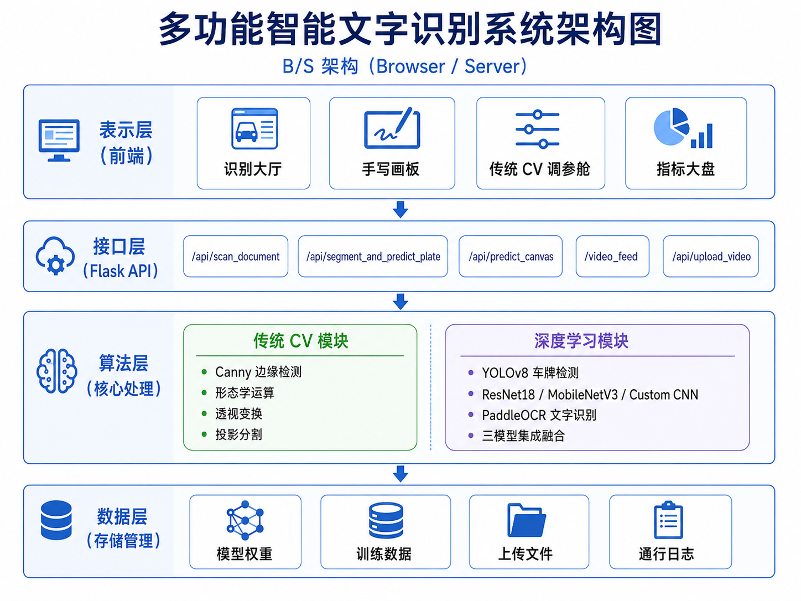

# 🔍 Smart Vision OCR — 多功能智能文字识别系统

基于 **OpenCV 传统算子 + PyTorch 深度学习** 融合的多功能文字识别系统，涵盖车牌检测识别、文档扫描OCR、手写字符实时识别三大核心功能。

> 🎓 武汉晴川学院 · 计算机视觉项目实践 · 课程设计项目

---

## 📸 系统效果展示

| 车牌识别（图片模式） | 车牌识别（视频模式） | 文档扫描与OCR |
|:---:|:---:|:---:|
|  |  |  |

| 手写画板三模型对比 | GradCAM 可解释性 | 传统CV调参舱 |
|:---:|:---:|:---:|
|  |  |  |

---

## 🏗️ 系统架构



---

## ✨ 核心功能

### 1. 🚗 车牌检测与识别
- **YOLOv8n** 自动定位车牌区域（mAP50: 99.3%）
- 垂直投影法字符切割 + 三模型 CNN 分类
- 集成融合策略：ResNet18(0.5) + MobileNetV3(0.3) + CustomCharCNN(0.2)
- 支持图片上传识别与视频流实时检测
- IoU 多目标追踪 + 置信度自适应重识别

### 2. 📄 文档扫描与OCR
- OpenCV 传统算子：Canny边缘检测 → 轮廓拟合 → 透视变换拉直
- 自适应二值化增强去阴影
- PaddleOCR 端到端文字识别
- 分步可视化展示处理过程

### 3. ✍️ 手写画板实时识别
- HTML5 Canvas 在线手写
- ResNet18 / MobileNetV3-Small / CustomCharCNN 三模型实时对比
- Top-5 概率分布可视化
- GradCAM 热力图可解释性分析

### 4. 🔬 传统CV交互调参
- Canny阈值、Sobel算子、二值化参数、HSV掩膜实时调节
- 参数效果即时可视化对比

### 5. 📊 指标大盘
- EMNIST / Plate 双数据集模型性能对比
- Accuracy / Precision / Recall / F1-Score
- 参数量、文件大小、推理速度等工程化指标

---

## 📁 项目结构

```
opencv/last/
├── app.py                          # Flask 主入口
├── config/settings.yaml            # 全局配置（训练参数、字符集）
├── train_all.py                    # 一键训练脚本
├── train_plate_detector.py         # YOLO 车牌检测器训练
├── train_ccpd.py                   # CCPD 字符提取+训练（一键）
├── download_ccpd.py                # CCPD 数据集下载与字符提取
├── requirements.txt                # Python 依赖清单
├── src/
│   ├── utils/                      # 工具模块
│   │   ├── helpers.py              #   设备、字符集、路径配置
│   │   ├── model_loader.py         #   模型权重加载
│   │   ├── ocr_engine.py           #   PaddleOCR 封装
│   │   └── gradcam.py              #   GradCAM 可解释性
│   ├── core/
│   │   ├── deep_learning/          # 深度学习模块
│   │   │   ├── resnet.py           #   ResNet18 模型定义
│   │   │   ├── mobilenet.py        #   MobileNetV3 模型定义
│   │   │   ├── custom_cnn.py       #   自定义 CNN（9层）
│   │   │   ├── trainer.py          #   通用训练管理类
│   │   │   ├── evaluator.py        #   模型评估
│   │   │   ├── dataset_emnist.py   #   EMNIST 数据加载
│   │   │   └── dataset_synthetic.py#   车牌字符数据加载
│   │   └── traditional/            # 传统 CV 模块
│   │       ├── plate_locator.py    #   车牌定位（HSV+形态学）
│   │       ├── segmenter.py        #   字符投影分割
│   │       ├── document_scanner.py #   文档扫描（Canny+轮廓）
│   │       ├── enhancer.py         #   图像增强（CLAHE+二值化）
│   │       └── base_processor.py   #   透视变换等基础操作
│   └── routes/                     # Flask 路由
│       ├── page_routes.py          #   页面路由
│       ├── cv_routes.py            #   车牌/文档/视频 API
│       └── dl_routes.py            #   画板/GradCAM API
├── templates/                      # HTML 模板
├── static/
│   ├── css/style.css               # 玻璃拟态暗色系样式
│   ├── js/app.js                   # 前端交互逻辑
│   └── results/                    # 训练曲线与混淆矩阵
├── weights/                        # 模型权重
│   ├── best_*_emnist.pth           #   EMNIST 三模型
│   ├── best_*_plate.pth            #   Plate 三模型
│   └── plate_detector8/weights/    #   YOLO 车牌检测器
├── scripts/                        # 数据处理脚本
│   ├── convert_ccpd_to_yolo.py     #   CCPD→YOLO 格式转换
│   ├── create_subset.py            #   创建数据子集
│   └── extract_chars_from_plates.py#   车牌字符切割
├── tests/                          # 单元测试
│   ├── test_plate_locator.py       #   车牌定位测试
│   ├── test_segmenter.py           #   字符分割测试
│   ├── test_enhancer.py            #   图像增强测试
│   ├── test_models.py              #   模型推理测试
│   ├── test_dataset.py             #   数据集测试
│   └── test_traditional.py         #   传统CV测试
├── data/                           # 数据集（不上传）
│   ├── plate_chars/                #   车牌字符切片（65类，43.6万张）
│   ├── CCPD/                       #   CCPD 原始数据
│   └── emnist/                     #   EMNIST 数据集
└── images/                         # 报告截图
```

---

## 🚀 快速开始

### 环境要求
- Python 3.x
- CUDA 12.8+（GPU 推荐）
- Conda 环境 `pytorch1`

### 1. 安装依赖
```bash
conda activate pytorch1
pip install -r requirements.txt
```

### 2. 下载数据集并训练
```bash
# 一键：下载CCPD → 提取字符 → 训练三模型 → 评估
python train_ccpd.py

# 或分步执行：
python download_ccpd.py          # 下载CCPD数据集
python train_all.py              # 训练全部模型

# 单独训练YOLO车牌检测器
python train_plate_detector.py
```

### 3. 启动Web服务
```bash
python app.py
```
浏览器打开 **http://127.0.0.1:5000**

### 4. 运行测试
```bash
# 端到端视频测试
python test_end_to_end_ocr.py example1.mp4

# 单元测试
python -m pytest tests/ -v
```

---

## 📊 实验结果

### 车牌字符识别（Plate Dataset）

| 模型 | Accuracy | Precision | Recall | F1-Score | 参数量 | 推理延迟 |
|------|----------|-----------|--------|----------|--------|----------|
| ResNet18 | **94.94%** | 89.55% | 89.06% | 89.26% | 11.2M | 0.024ms |
| MobileNetV3 | 91.31% | 87.50% | 82.99% | 84.64% | 1.6M | 0.047ms |
| CustomCharCNN | **95.93%** | 93.04% | 90.59% | 91.67% | 2.4M | 0.009ms |

### EMNIST 手写字符识别

| 模型 | Accuracy | Precision | Recall | F1-Score | 参数量 | 推理延迟 |
|------|----------|-----------|--------|----------|--------|----------|
| ResNet18 | **88.47%** | 88.86% | 88.47% | 88.32% | 11.2M | 0.019ms |
| MobileNetV3 | 86.96% | 87.60% | 86.96% | 86.74% | 1.6M | 0.039ms |
| CustomCharCNN | 87.27% | 87.93% | 87.27% | 87.04% | 2.4M | 0.007ms |

### YOLO 车牌检测器

| 指标 | 数值 |
|------|------|
| mAP50 | **99.3%** |
| mAP50-95 | **92.0%** |
| Precision | 99.7% |
| Recall | 99.7% |

---

## 🛠️ 技术栈

| 类别 | 技术 |
|------|------|
| 深度学习框架 | PyTorch 2.9.1 |
| 目标检测 | YOLOv8n (Ultralytics) |
| 字符分类 | ResNet18, MobileNetV3-Small, CustomCharCNN |
| OCR引擎 | PaddleOCR 3.6.0 |
| 图像处理 | OpenCV 4.11 |
| Web框架 | Flask 3.1 |
| 前端 | HTML5 + CSS3 + JavaScript |

---

## 📝 License

本项目采用 [MIT License](LICENSE)，详见 LICENSE 文件。

**免责声明：**
- 本项目仅供学术学习与课程设计使用，**禁止用于商业用途**
- 项目中的车牌数据来源于 [CCPD 公开数据集](https://github.com/detectRecog/CCPD)，手写字符数据来源于 [EMNIST 数据集](https://www.nist.gov/itl/products-services/emnist-dataset)，均仅用于学术研究
- 如有图片涉及隐私或版权问题，请联系作者删除，将在 24 小时内处理
- 禁止将本项目用于任何违法违规场景
