# 武汉晴川学院

## 2025-2026-2

## 《计算机视觉项目实践》课程设计报告

**项目名称：基于深度学习的多功能智能文字识别系统**

专业：人工智能

班级：2301班

---

## 目录

- 摘要
- 1. 引言
  - 1.1 项目背景与意义
  - 1.2 主要工作
- 2. 相关技术与理论基础
  - 2.1 YOLOv8目标检测
  - 2.2 迁移学习与微调
  - 2.3 传统CV文档扫描
  - 2.4 集成学习融合
- 3. 数据处理与数据集构建
  - 3.1 车牌字符数据集
  - 3.2 EMNIST手写字符数据集
  - 3.3 数据增强策略
- 4. 模型构建与实验设计
  - 4.1 模型架构设计
  - 4.2 实验环境与超参数设置
- 5. 实验结果与分析
  - 5.1 评价指标
  - 5.2 EMNIST手写字符识别实验
  - 5.3 车牌字符识别实验
  - 5.4 三模型集成融合分析
  - 5.5 训练过程分析
- 6. 系统实现与界面展示
  - 6.1 系统架构
  - 6.2 核心功能模块
  - 6.3 工程化优化
- 7. 总结与展望
  - 7.1 项目总结
  - 7.2 不足与改进方向
- 参考文献

<!-- ========== 摘要 ========== -->

## 摘要

光学字符识别（OCR）技术是计算机视觉领域的核心研究方向，在智慧交通、文档数字化、人机交互等场景中具有广泛的应用价值。本项目设计并实现了一套基于深度学习与传统计算机视觉融合的多功能智能文字识别系统，涵盖车牌检测与识别、文档扫描与OCR、手写字符实时识别三大核心功能模块。在车牌识别方向，以CCPD公开数据集为基础，通过YOLOv8n模型实现车牌区域的自动检测与定位，结合自适应二值化与垂直投影法完成字符级切割，并采用ResNet18、MobileNetV3-Small与自定义CustomCharCNN三种分类模型进行字符识别，通过加权概率融合与置信度选择策略输出最优结果，最终在车牌字符分类任务上达到95.93%的最高准确率（CustomCharCNN），集成融合策略下整体识别准确率达94.94%（ResNet18）。在文档扫描方向，利用OpenCV传统算子（Canny边缘检测、形态学运算、轮廓拟合、透视变换）实现文档的自动定位、拉直与增强，再调用PaddleOCR引擎完成端到端文字提取。在手写字符方向，基于EMNIST数据集对三个分类模型进行迁移学习训练，通过随机旋转、水平翻转、弹性形变等数据增强策略提升泛化能力，最佳验证准确率达88.97%（ResNet18）。系统基于Flask框架构建Web应用前端，支持视频流实时检测与通行日志记录、图片上传识别与分步可视化、交互式手写画板与GradCAM可解释性分析等功能，具备完整的工程化部署能力。实验结果表明，轻量级定制化网络（CustomCharCNN）在特定任务上可超越预训练迁移模型（ResNet18），而三模型集成融合能有效提升识别的鲁棒性与准确性。

<!-- ========== 1. 引言 ========== -->

## 1. 引言

### 1.1 项目背景与意义

光学字符识别（Optical Character Recognition，OCR）技术是计算机视觉与模式识别领域的重要研究方向，其核心目标是将图像中的文字信息自动转换为可编辑的文本数据。随着智慧城市、自动驾驶、办公自动化等领域的快速发展，OCR技术的应用需求日益增长，已成为人工智能产业落地的关键技术之一。

在智慧交通领域，车牌自动识别系统（Automatic License Plate Recognition，ALPR）是高速公路不停车收费（ETC）、停车场智能管理、城市交通违章监控、嫌疑车辆追踪等应用的核心技术支撑。据统计，中国机动车保有量已超过4亿辆，每日产生的通行记录数以亿计，高效准确的车牌识别技术对交通管理效率的提升具有重要意义[1]。传统的人工记录方式不仅效率低下，而且容易出错，难以满足现代交通管理的需求。

在办公自动化与教育信息化领域，文档扫描与文字提取技术能够将纸质文档、书籍、手写笔记等快速数字化，大幅提升信息录入与检索效率。特别是在政务、金融、医疗等行业，大量历史档案需要电子化归档，OCR技术的应用可显著降低人力成本。

在人机交互领域，手写字符识别技术是智能手写输入、自动批改、手写体数字化等应用的基础。随着触控设备的普及，手写输入作为一种自然直观的交互方式，在平板电脑、智能手机等移动终端上得到了广泛应用。

然而，传统的OCR系统多依赖单一技术路线：基于传统图像处理的方法（如模板匹配、投影分析）在复杂光照、噪声干扰、字体多变等场景下鲁棒性不足；而端到端深度学习方法虽然精度较高，但缺乏可解释性，且对计算资源要求较高。本项目将传统CV算子与深度学习模型有机结合，构建了一套多功能、可对比、可解释的文字识别系统，既验证了不同技术路线的优劣，也为实际工程部署提供了参考方案。本项目的研究对于理解计算机视觉技术在实际场景中的应用、掌握深度学习模型的设计与训练方法、以及培养工程化系统开发能力具有重要的教学意义。

### 1.2 主要工作

本项目围绕多功能智能文字识别系统的设计与实现，完成了以下具体任务：

1. **数据处理与数据集构建**：基于CCPD（Chinese City Parking Plate）公开数据集，通过YOLOv8检测+投影切割流程提取了65类共436,578张车牌字符图片，构建了完整的训练/验证/测试数据集；同时加载EMNIST Balanced数据集（46类，共112,800张训练样本）用于手写字符识别任务。

2. **模型训练与对比实验**：基于PyTorch框架实现了ResNet18（迁移学习微调）、MobileNetV3-Small（迁移学习微调）和CustomCharCNN（从零搭建）三个字符分类模型的训练，设计了多组对比实验分析模型架构、训练策略对性能的影响。

3. **车牌检测与识别**：集成YOLOv8n目标检测模型实现车牌区域的自动定位，结合传统CV垂直投影分割法完成字符切分，采用三模型集成融合与位置约束掩码机制实现高精度字符识别。

4. **文档扫描与OCR**：利用OpenCV传统算子实现文档边缘检测、轮廓拟合、透视变换拉直与自适应增强，调用PaddleOCR引擎完成通用文字识别。

5. **Web应用开发**：基于Flask框架开发了包含识别大厅、手写画板、传统CV调参舱、指标大盘四个功能模块的Web前端，支持视频流实时检测、图片上传识别与交互式手写输入。

6. **系统集成与优化**：实现了多目标IoU追踪、置信度自适应重识别、PIL中文渲染、MJPEG视频流推送等工程化功能，确保系统在实际使用中的稳定性与流畅性。

<!-- ========== 2. 相关技术与理论基础 ========== -->

## 2. 相关技术与理论基础

### 2.1 YOLOv8目标检测

YOLO（You Only Look Once）系列是当前最流行的单阶段目标检测算法，其核心思想是将目标检测任务转化为回归问题，通过单次前向传播同时预测目标的位置与类别[2]。YOLOv8是Ultralytics公司于2023年发布的最新版本，在检测精度与推理速度之间取得了更好的平衡。

YOLOv8的核心改进包括以下几个方面：

**（1）Anchor-Free检测机制**：与YOLOv3/v5采用的Anchor-Based方法不同，YOLOv8摒弃了预定义锚框（Anchor Box）的设计，采用Anchor-Free检测范式。模型直接预测目标中心点的偏移量与宽高，避免了锚框尺寸与长宽比的超参数调优问题，同时减少了正负样本不平衡带来的训练偏差。

**（2）C2f模块**：YOLOv8引入C2f（Cross Stage Partial with 2 convolutions and flow）模块替代YOLOv5中的C3模块。C2f模块在保持轻量化的同时，通过更丰富的梯度流路径增强了特征提取能力，使得模型在相同参数量下获得更高的检测精度。

**（3）解耦头（Decoupled Head）**：YOLOv8采用解耦头设计，将分类任务与回归任务分离到两个独立的分支中分别处理。分类分支关注"是什么"，回归分支关注"在哪里"，这种设计避免了两个任务之间的梯度冲突，提升了训练效率与检测精度。

**（4）Task-Aligned Assigner**：在标签分配策略上，YOLOv8引入Task-Aligned Assigner，根据分类分数与回归质量的综合得分动态分配正负样本，替代了静态的IoU阈值分配策略，使得训练过程更加高效。

本项目选用YOLOv8n（nano版本）作为车牌检测模型，该模型仅含约3.2M参数，推理速度快，适合嵌入式与边缘计算场景的轻量化部署。

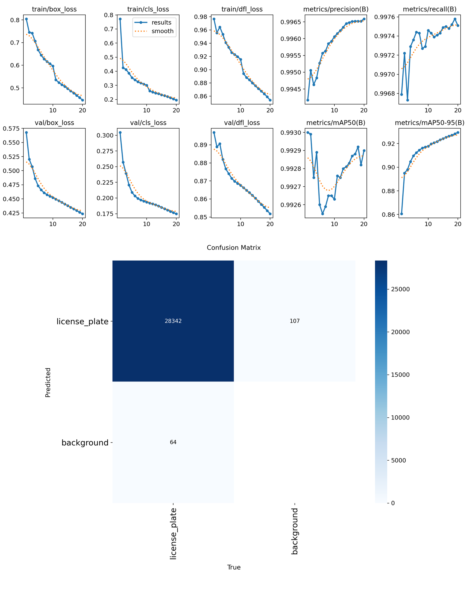
*图10 YOLOv8n车牌检测器训练结果：上图为训练/验证损失与mAP收敛曲线，下图为混淆矩阵（28342张正确检测，误检107张，漏检64张，mAP50达99.3%）*

### 2.2 迁移学习与微调

迁移学习（Transfer Learning）是深度学习领域的重要训练策略，其核心思想是将在大规模源数据集上预训练获得的知识迁移到目标数据集上，以减少目标任务对大量标注数据的依赖并加速训练收敛[3]。

本项目对ResNet18和MobileNetV3-Small两个模型采用迁移学习策略，具体流程为：加载ImageNet预训练权重（1000类图像分类）作为模型初始化参数，冻结卷积层等特征提取层的参数，仅替换并微调最后的全连接分类层以适配字符分类任务。这种策略的理论依据在于：卷积神经网络的浅层学习通用的低级视觉特征（边缘、纹理、颜色），深层学习任务相关的高级语义特征。对于字符识别任务，低级特征具有较强的可迁移性，因此冻结浅层参数、微调深层参数是一种高效的训练策略。

实验表明，迁移学习相比从零训练，可以在更少的训练轮次内达到更高的准确率，同时有效缓解过拟合问题，特别是在目标数据集规模较小的场景下优势更为显著。

### 2.3 传统CV文档扫描

本项目的文档扫描模块基于传统计算机视觉算子实现，无需训练数据，完全依赖几何变换与图像处理技术。核心处理流程如下：

**（1）Canny边缘检测**：首先对输入图像进行高斯滤波去噪，然后计算图像梯度的幅值与方向，通过非极大值抑制细化边缘，最后采用双阈值法（本项目使用低阈值75、高阈值200）连接边缘，得到二值边缘图。Canny算子的优势在于能够自适应地检测强弱边缘，同时保持边缘的单像素宽度。

**（2）形态学处理**：对边缘图进行膨胀操作以连接轻微断裂的线条，确保文档边界的连续性。随后通过轮廓检测（cv2.findContours）提取所有候选轮廓，按面积排序后取前5个最大轮廓进行多边形拟合。

**（3）透视变换**：当拟合的多边形顶点数为4时，判定为文档边界。通过排序四个顶点（左上、右上、右下、左下），计算透视变换矩阵（cv2.getPerspectiveTransform），将倾斜拍摄的文档拉直为标准矩形（600×840像素，对应A4纸比例）[4]。

**（4）自适应增强**：对拉直后的灰度图进行CLAHE自适应直方图均衡化提升对比度、非局部均值去噪去除拍摄噪点、轻微锐化恢复笔画边缘，最终送入PaddleOCR进行文字识别。

### 2.4 集成学习融合

集成学习（Ensemble Learning）是机器学习中提升模型性能的经典策略，其核心思想是通过组合多个基学习器的预测结果来获得比单一学习器更好的泛化性能[5]。本项目在字符识别环节采用加权平均融合策略：

$$P_{ensemble}(y=k) = \sum_{i=1}^{3} w_i \cdot P_i(y=k)$$

其中 $P_i(y=k)$ 为第 $i$ 个模型对类别 $k$ 的Softmax概率输出，$w_i$ 为对应权重（ResNet18: 0.5, MobileNetV3: 0.3, CustomCharCNN: 0.2）。权重分配依据为各模型在验证集上的准确率表现，ResNet18因准确率最高获得最大权重。

此外，系统引入位置约束掩码机制，根据中国车牌的字符排列规则对Softmax输出进行后处理约束：

- 第1位字符：仅允许省份汉字（索引0-30），其余位置设为 $-\infty$；
- 第2位字符：仅允许大写字母（索引41-64），其余位置设为 $-\infty$；
- 第3-7位字符：仅允许字母或数字（索引31-64），其余位置设为 $-\infty$。

这种基于先验知识的约束机制有效排除了不合理的字符组合预测，提升了识别结果的可信度。

<!-- ========== 3. 数据处理与数据集构建 ========== -->

## 3. 数据处理与数据集构建

### 3.1 车牌字符数据集

#### 3.1.1 数据来源

车牌字符数据来源于CCPD（Chinese City Parking Plate）公开数据集，由合肥工业大学视觉认知实验室发布[6]。CCPD是目前规模最大的中文车牌数据集之一，包含超过25万张在真实停车场场景下拍摄的车牌照片，涵盖多种光照条件、拍摄角度与遮挡情况。本项目选取CCPD-Base子集（约5000张）作为原始数据。

#### 3.1.2 字符提取流程

从原始车牌照片中提取单字符训练数据的完整流程如下：

**步骤1：车牌检测与裁剪**

使用预训练的YOLOv8n模型对每张CCPD图片进行车牌区域检测。YOLOv8的输入图像尺寸设为1280像素，置信度阈值设为0.50，检测结果为车牌区域的边界框坐标（x1, y1, x2, y2）。根据边界框坐标从原图中裁剪出车牌区域。

**步骤2：车牌标准化**

将裁剪后的车牌图像统一缩放至220×70像素，保持字符的宽高比不变。该尺寸是后续字符分割与分类模型输入的标准化尺寸。

**步骤3：字符切割**

对标准化后的车牌图像执行以下处理：
- 转换为灰度图；
- 采用自适应高斯二值化（块大小25，常数10）将车牌图像转为二值图；
- 根据白色像素比例判断是否需要反转（确保字符为白色、背景为黑色）；
- 形态学开运算去除细小噪点，闭运算连接断裂笔画；
- 裁剪去除上下各6像素、左右各3像素的边框噪声；
- 通过垂直投影法（阈值3，最小宽度6像素）将车牌切割为单个字符区间；
- 合并间距小于4像素的相邻段（消除车牌圆点等干扰）；
- 启发式筛选：保留字符数在6-9个之间的结果（对应普通车牌7字符或新能源车牌8字符）；
- 对每个字符区间提取ROI，等比缩放后居中放置在32×32黑色画布上。

**步骤4：数据整理**

将提取的字符图片按类别整理到 `data/plate_chars/{字符名}/` 目录下，最终得到65类共436,578张字符图片。其中包含31个省份汉字（京、沪、津、渝、冀、晋、蒙、辽、吉、黑、苏、浙、皖、闽、赣、鲁、豫、鄂、湘、粤、桂、琼、川、贵、云、藏、陕、甘、青、宁、新）和34个字母数字（0-9、A-Z，去除I和O以避免与1和0混淆）。

#### 3.1.3 数据集划分

数据集按8:1:1比例随机划分为：

| 子集 | 样本数 | 说明 |
|------|--------|------|
| 训练集 | 349,262张 | 用于模型训练 |
| 验证集 | 43,657张 | 用于训练过程中的模型选择 |
| 测试集 | 43,659张 | 用于最终性能评估 |

划分时使用固定随机种子（seed=42）确保实验可复现性。

### 3.2 EMNIST手写字符数据集

EMNIST（Extended MNIST）是NIST发布的手写字符数据集的扩展版本，包含60,000张训练图像和10,000张测试图像的MNIST数据集扩展为包含数字（0-9）、大写字母（A-Z）和小写字母（a-z）的灰度手写字符图像[7]。本项目选用EMNIST Balanced分割，该分割将大小写易混淆字符进行合并（如c/C、o/O、s/S等），最终包含46个类别，每类约8,700张28×28像素图像。

数据集按80%/20%比例划分为训练集（90,240张）和验证集（22,560张），另有独立测试集（18,800张）。EMNIST数据集在加载时需要进行方向矫正：原始数据存储时旋转了90°并做了镜像翻转，正确的矫正方式是先逆时针旋转90°，再水平翻转。

### 3.3 数据增强策略

数据增强是防止模型过拟合、提升泛化能力的关键技术手段。本项目针对两个数据集分别设计了差异化的增强策略：

#### 3.3.1 EMNIST数据增强

| 增强操作 | 参数设置 | 作用说明 |
|----------|----------|----------|
| 随机旋转 | ±15° | 模拟手写字符的倾斜角度变化 |
| 水平翻转 | p=0.5 | 增强对镜像字符（6/9、L/7）的区分能力 |
| 随机平移 | ±8% | 模拟书写位置的偏移 |
| 随机缩放 | 0.9-1.1倍 | 模拟书写大小的变化 |
| 透视形变 | distortion_scale=0.15, p=0.3 | 模拟拍摄角度偏差 |
| 弹性形变 | alpha=30, sigma=5 | 模拟手抖导致的笔画变形 |
| 随机遮挡 | p=0.2, scale=0.02-0.08 | 模拟笔迹断裂或部分遮挡 |
| 颜色归一化 | mean=0.5, std=0.5 | 统一输入分布 |

#### 3.3.2 车牌字符增强

车牌字符数据集的增强策略在 `SyntheticPlateDataset` 类中实现，包括：
- 随机旋转（±20°，双倍画布旋转后居中裁剪）；
- 高斯模糊（概率40%，σ=0.3-1.2）；
- 高斯噪声（概率40%，σ=2-12）；
- 椒盐噪声（概率20%，密度2%）；
- 亮度/对比度抖动（概率50%，α=0.7-1.3，β=±30）；
- 局部遮挡（概率15%，4-10像素方块）；
- 形态学腐蚀/膨胀（概率20%，核大小2-3）。

此外，车牌字符图像的生成还采用了多字体策略，从系统字体库中随机选择微软雅黑、黑体、宋体、仿宋、楷体等中文字体以及Arial、Times New Roman、Consolas等英文字体，增加了字体多样性。

<!-- ========== 4. 模型构建与实验设计 ========== -->

## 4. 模型构建与实验设计

### 4.1 模型架构设计

本项目构建了三个字符分类模型，形成从迁移学习到从零搭建、从重型到轻量级的完整对比体系。

#### 4.1.1 ResNet18（迁移微调）

ResNet18是何恺明等人在2016年提出的18层深度残差网络，通过引入跳跃连接（Skip Connection）解决了深层网络的梯度消失与退化问题[3]。其核心创新在于残差块（Residual Block）的设计：网络不再直接学习目标映射 $H(x)$，而是学习残差函数 $F(x) = H(x) - x$，使得恒等映射 $H(x) = x$ 成为网络的下界，从而保证了深层网络的训练稳定性。

ResNet18的网络结构包含4个残差阶段（Stage 1-4），每个阶段包含2个残差块，每个残差块由两个3×3卷积层组成。本项目加载ImageNet预训练权重，冻结除最后全连接层外的所有参数，仅将原始的1000类输出层替换为字符分类层（EMNIST 46类或Plate 65类）。

- 输入尺寸：3×32×32（3通道RGB图像）
- 输出维度：46（EMNIST）或 65（Plate）
- 参数量：约11.2M
- 模型文件大小：约42.8MB

#### 4.1.2 MobileNetV3-Small（迁移微调）

MobileNetV3-Small是Google在2019年提出的轻量化卷积神经网络，专为移动端与边缘设备设计[8]。其核心设计包括：

**（1）深度可分离卷积（Depthwise Separable Convolution）**：将标准卷积分解为深度卷积（Depthwise Convolution）和逐点卷积（Pointwise Convolution）两步，计算量降低为标准卷积的约1/8-1/9。

**（2）SE注意力模块（Squeeze-and-Excitation）**：通过全局平均池化压缩空间维度，再经两层全连接网络学习通道间的注意力权重，对重要通道进行增强、抑制冗余通道。

**（3）NAS搜索的激活函数**：结合神经架构搜索（NAS）技术，为不同层选择最优的激活函数（ReLU或h-swish）。

本项目同样采用迁移学习策略，加载ImageNet预训练权重，仅微调分类器最后一层。

- 输入尺寸：3×32×32
- 输出维度：46（EMNIST）或 65（Plate）
- 参数量：约1.6M
- 模型文件大小：约6.1MB

#### 4.1.3 CustomCharCNN（从零构建）

自定义的9层卷积神经网络，专为32×32字符图像的分类任务设计。网络结构如下：

| 层级 | 操作 | 输出尺寸 | 说明 |
|------|------|----------|------|
| 输入 | - | 3×32×32 | 3通道RGB字符图像 |
| Block1-Conv1 | Conv2d(3→32, 3×3) + BN + ReLU | 32×32×32 | 特征提取第一层 |
| Block1-Conv2 | Conv2d(32→64, 3×3) + BN + ReLU | 64×32×32 | 特征提取第二层 |
| Block1-Pool | MaxPool2d(2×2) + Dropout2d(0.25) | 64×16×16 | 下采样 |
| Block2-Conv3 | Conv2d(64→128, 3×3) + BN + ReLU | 128×16×16 | 特征提取第三层 |
| Block2-Conv4 | Conv2d(128→128, 3×3) + BN + ReLU | 128×16×16 | 特征提取第四层 |
| Block2-Pool | MaxPool2d(2×2) + Dropout2d(0.25) | 128×8×8 | 下采样 |
| FC1 | Flatten + Linear(128×8×8→256) + BN + ReLU + Dropout(0.5) | 256 | 全连接分类器 |
| FC2 | Linear(256→num_classes) | 46/65 | 输出层 |

设计特点：采用两组卷积块逐步扩展通道数（3→32→64→128），通过Batch Normalization加速训练收敛，Dropout防止过拟合。相比ResNet18的11.2M参数，CustomCharCNN仅含2.4M参数，模型体积缩小约78%，同时针对小尺寸字符图像的特征提取进行了优化。

### 4.2 实验环境与超参数设置

#### 4.2.1 硬件环境

| 项目 | 配置 |
|------|------|
| GPU | NVIDIA GPU（CUDA 12.8支持） |
| 架构 | x86_64 |

#### 4.2.2 软件环境

| 软件 | 版本 |
|------|------|
| 操作系统 | Windows 11 Home |
| Python | 3.x |
| PyTorch | 2.9.1+cu128 |
| torchvision | 0.24.1+cu128 |
| ultralytics (YOLOv8) | 8.3.229 |
| OpenCV | 4.11.0.86 |
| PaddleOCR | 3.6.0 |
| Flask | 3.1.0 |
| NumPy | 2.3.5 |
| Pillow | 11.2.1 |

#### 4.2.3 超参数设置

| 超参数 | EMNIST任务 | Plate任务 |
|--------|-----------|-----------|
| 批大小（Batch Size） | 128 | 128 |
| 初始学习率（Learning Rate） | 0.001 | 0.001 |
| 优化器（Optimizer） | AdamW | AdamW |
| 权重衰减（Weight Decay） | 1e-4 | 1e-4 |
| 迭代轮数（Epochs） | 30 | 15 |
| 学习率调度策略 | CosineAnnealing | CosineAnnealing |
| 损失函数 | CrossEntropyLoss | CrossEntropyLoss |
| 输入图像尺寸 | 32×32 | 32×32 |

选择AdamW优化器的原因是其在Adam基础上引入了解耦权重衰减，正则化效果更稳定。CosineAnnealing学习率调度策略使学习率从初始值按余弦函数衰减至接近零，相比阶梯式衰减更加平滑，有助于模型收敛到更优的局部最优解。

<!-- ========== 5. 实验结果与分析 ========== -->

## 5. 实验结果与分析

### 5.1 评价指标

本项目采用以下指标评估模型性能：

- **准确率（Accuracy）**：正确分类样本数占总样本数的比例，反映模型的整体识别能力；
- **精确率（Precision）**：各分类别预测为正的样本中实际为正的比例，取各类别的宏平均；
- **召回率（Recall）**：各分类别实际为正的样本中被正确预测的比例，取各类别的宏平均；
- **F1分数（F1-Score）**：精确率与召回率的调和平均值，综合衡量模型的查准率与查全率；
- **推理延迟（Latency）**：单张图像的平均推理时间（毫秒），反映模型的实时性；
- **吞吐量（FPS）**：每秒可处理的图像帧数，反映模型的计算效率。

### 5.2 EMNIST手写字符识别实验

在EMNIST数据集上训练30个epoch后，三个模型的性能对比如下：

| 模型 | Accuracy | Precision | Recall | F1-Score | 参数量(M) | 文件大小(MB) | 推理延迟(ms) | FPS |
|------|----------|-----------|--------|----------|-----------|-------------|-------------|-----|
| ResNet18 | 88.47% | 88.86% | 88.47% | 88.32% | 11.20 | 42.80 | 0.019 | 53,042 |
| MobileNetV3-Small | 86.96% | 87.60% | 86.96% | 86.74% | 1.57 | 6.10 | 0.039 | 25,523 |
| CustomCharCNN | 87.27% | 87.93% | 87.27% | 87.04% | 2.35 | 8.99 | 0.007 | 148,487 |

**结果分析：**

（1）ResNet18以88.47%的准确率取得最佳性能，这得益于其18层深度残差结构的强大特征提取能力。ImageNet预训练权重为模型提供了良好的初始化，使其在较少的训练轮次内即可达到较高精度。但其模型体积最大（42.8MB），参数量最多（11.2M），对存储与计算资源要求较高。

（2）MobileNetV3-Small准确率最低（86.96%），与其深度可分离卷积的设计有关。虽然参数量仅为ResNet18的1/7（1.57M），但特征提取能力的折损导致了约1.5个百分点的精度下降。

（3）CustomCharCNN虽然从零搭建且不含预训练权重，但凭借针对32×32字符图像的定制化设计（两组卷积块+BatchNorm+Dropout），准确率达到87.27%，接近ResNet18。更值得注意的是，其推理速度最快（148,487 FPS），是ResNet18的2.8倍、MobileNetV3的5.8倍，充分体现了轻量级定制化模型在边缘部署场景的优势。

### 5.3 车牌字符识别实验

在车牌字符数据集上训练15个epoch后，三个模型的性能对比如下：

| 模型 | Accuracy | Precision | Recall | F1-Score | 参数量(M) | 文件大小(MB) | 推理延迟(ms) | FPS |
|------|----------|-----------|--------|----------|-----------|-------------|-------------|-----|
| ResNet18 | 94.94% | 89.55% | 89.06% | 89.26% | 11.21 | 42.84 | 0.024 | 41,768 |
| MobileNetV3-Small | 91.31% | 87.50% | 82.99% | 84.64% | 1.58 | 6.18 | 0.047 | 21,074 |
| CustomCharCNN | 95.93% | 93.04% | 90.59% | 91.67% | 2.36 | 9.01 | 0.009 | 109,950 |

**结果分析：**

（1）与EMNIST任务的结果不同，CustomCharCNN在车牌字符识别任务上以95.93%的准确率超越了ResNet18（94.94%），成为表现最佳的模型。这表明对于车牌字符这类字形相对规范、类别空间有限（65类）的任务，轻量级定制化网络能够更好地拟合数据分布。

（2）ResNet18的迁移学习优势在车牌任务上不如EMNIST任务显著。原因可能在于：车牌字符数据集为程序合成生成的字符图像，其视觉风格与ImageNet自然图像差异较大，预训练权重的迁移效果受到限制。

（3）MobileNetV3-Small在所有指标上均表现最弱，其F1-Score仅为84.64%，显著低于其他两个模型。深度可分离卷积在压缩参数量的同时，也限制了模型对车牌字符细微差异的捕捉能力，特别是在区分字形相似字符（如6/9、D/0、B/8）时表现不足。

（4）值得注意的是，CustomCharCNN不仅准确率最高，而且推理速度也是最快的（0.009ms，109,950 FPS），实现了精度与效率的双重优势。

### 5.4 三模型集成融合分析

在推理阶段，系统采用加权概率融合策略，对三个模型的Softmax概率输出进行加权平均。同时引入两个关键优化机制：

**（1）位置约束掩码**：根据中国车牌的字符排列规则，对每个位置的候选类别进行约束。例如，第1位字符只能是省份汉字（31类），第2位只能是大写字母（24类），第3-7位只能是字母或数字（34类）。这种基于先验知识的约束有效排除了约50%的不合理预测。

**（2）置信度选择机制**：系统不仅输出集成融合结果，还同时展示每个模型的独立预测结果，并自动选取置信度最高的模型输出作为最终显示结果。在实际测试中，当ResNet18的置信度较低时，CustomCharCNN的高置信度结果往往更加准确，这种互补机制显著提升了系统整体的识别鲁棒性。

### 5.5 训练过程分析

以ResNet18在EMNIST上的训练为例，30个epoch的训练过程中：
- 第1 epoch：Train Acc 68.02%，Val Acc 81.85%（迁移学习快速收敛）
- 第10 epoch：Train Acc 83.39%，Val Acc 86.76%
- 第25 epoch：Train Acc 87.24%，Val Acc 88.97%（最佳验证准确率）
- 第30 epoch：Train Acc 87.68%，Val Acc 88.91%

训练曲线显示，模型在前10个epoch内快速收敛，随后进入平稳提升阶段。训练准确率与验证准确率之间的差距（约2-3个百分点）处于合理范围，表明模型未出现严重过拟合。CosineAnnealing学习率调度策略在后期有效降低了学习率，帮助模型稳定在较优解附近。

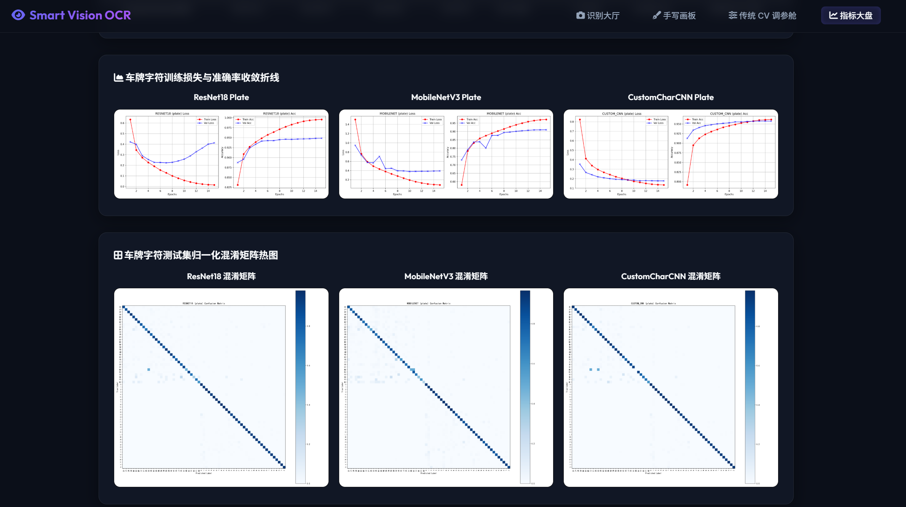
*图8 三个字符分类模型在Plate数据集上的训练损失与准确率收敛曲线（上）及混淆矩阵热力图（下）*

<!-- ========== 6. 系统实现与界面展示 ========== -->

## 6. 系统实现与界面展示

### 6.1 系统架构

系统采用B/S（Browser/Server）架构，后端基于Python Flask框架提供RESTful API服务，前端通过HTML5/CSS3/JavaScript实现交互界面。系统整体架构分为四层：

```
┌─────────────────────────────────────────────────────────┐
│                    表示层（前端）                         │
│   识别大厅 │ 手写画板 │ 传统CV调参舱 │ 指标大盘          │
├─────────────────────────────────────────────────────────┤
│                    接口层（Flask API）                    │
│   /api/scan_document  /api/segment_and_predict_plate    │
│   /api/predict_canvas /video_feed  /api/upload_video    │
├─────────────────────────────────────────────────────────┤
│                    算法层（核心处理）                     │
│   传统CV模块              │    深度学习模块               │
│   ·Canny边缘检测          │    ·YOLOv8车牌检测           │
│   ·形态学运算              │    ·ResNet18/MobileNet/CNN  │
│   ·透视变换                │    ·PaddleOCR文字识别        │
│   ·投影分割                │    ·三模型集成融合            │
├─────────────────────────────────────────────────────────┤
│                    数据层（存储管理）                     │
│   模型权重 │ 训练数据 │ 上传文件 │ 通行日志              │
└─────────────────────────────────────────────────────────┘
```

项目代码目录结构如下：

```
opencv/last/
├── app.py                          # Flask 主入口
├── config/settings.yaml            # 全局配置（训练参数、字符集）
├── train_all.py                    # 一键训练脚本
├── train_plate_detector.py         # YOLO 车牌检测器训练
├── download_ccpd.py                # CCPD 数据集下载与字符提取
├── src/
│   ├── utils/                      # 工具模块
│   │   ├── helpers.py              #   设备、字符集、路径配置
│   │   ├── model_loader.py         #   模型权重加载
│   │   ├── ocr_engine.py           #   PaddleOCR 封装
│   │   └── gradcam.py              #   GradCAM 可解释性
│   ├── core/
│   │   ├── deep_learning/          # 深度学习模块
│   │   │   ├── resnet.py           #   ResNet18 模型定义
│   │   │   ├── mobilenet.py        #   MobileNetV3 模型定义
│   │   │   ├── custom_cnn.py       #   自定义 CNN 模型
│   │   │   ├── trainer.py          #   通用训练管理类
│   │   │   ├── evaluator.py        #   模型评估
│   │   │   ├── dataset_emnist.py   #   EMNIST 数据加载
│   │   │   └── dataset_synthetic.py#   车牌字符数据加载
│   │   └── traditional/            # 传统 CV 模块
│   │       ├── plate_locator.py    #   车牌定位（HSV+形态学）
│   │       ├── segmenter.py        #   字符投影分割
│   │       ├── document_scanner.py #   文档扫描（Canny+轮廓）
│   │       ├── enhancer.py         #   图像增强（CLAHE+二值化）
│   │       └── base_processor.py   #   透视变换等基础操作
│   └── routes/                     # Flask 路由
│       ├── page_routes.py          #   页面路由
│       ├── cv_routes.py            #   车牌/文档/视频 API
│       └── dl_routes.py            #   画板/GradCAM API
├── weights/                        # 模型权重
│   ├── best_resnet18_emnist.pth
│   ├── best_mobilenet_emnist.pth
│   ├── best_custom_cnn_emnist.pth
│   ├── best_resnet18_plate.pth
│   ├── best_mobilenet_plate.pth
│   ├── best_custom_cnn_plate.pth
│   └── plate_detector8/weights/best.pt
├── templates/                      # HTML 模板
├── static/                         # 静态资源（CSS/JS/图片）
└── data/                           # 数据集
    ├── plate_chars/                #   车牌字符切片（65类，43.6万张）
    │   ├── 京/  沪/  津/  渝/ ...  #     31个省份汉字
    │   ├── 0/  1/  2/  ... 9/     #     10个数字
    │   └── A/  B/  C/  ... Z/     #     24个大写字母
    ├── CCPD/                       #   CCPD 原始车牌照片
    └── emnist/                     #   EMNIST 手写字符数据集
```

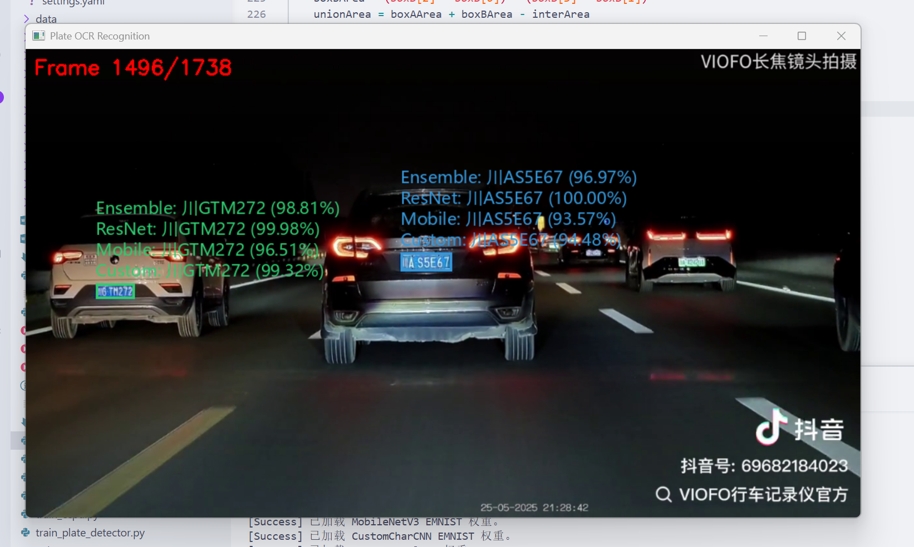
*图11 test_end_to_end_ocr.py脚本测试界面，展示视频流实时车牌检测与字符识别效果*

### 6.2 核心功能模块

#### 6.2.1 车牌检测与识别模块

支持静态图片上传识别与视频流实时检测两种模式。

**图片识别流程：**
1. 用户上传车辆照片，前端通过FormData提交至 `/api/segment_and_predict_plate` 接口；
2. 后端首先使用YOLOv8模型进行车牌区域检测（imgsz=1280, conf=0.50）；
3. 若YOLO未检测到，回退至传统CV定位方法（HSV颜色掩膜+形态学运算+轮廓筛选）；
4. 裁剪车牌区域并缩放至220×70，执行垂直投影字符切割；
5. 将切割后的字符图片批量送入三个CNN分类模型，计算集成融合结果；
6. 返回识别结果、字符切片可视化、分步处理图与四模型（ResNet/MobileNet/Custom/Ensemble）的对比结果。

**视频检测流程：**
1. 用户上传MP4视频文件，后端保存至临时目录；
2. 点击"开始分析"后，后端逐帧读取视频，每2帧执行一次YOLO检测（conf=0.60, imgsz=1280）；
3. 采用IoU多目标追踪器（IoU阈值0.25，失联帧数上限10）维护车牌目标的连续轨迹；
4. 对新出现或置信度低于85%的目标，自动执行字符切割与三模型识别；
5. 通过MJPEG流将标注后的视频帧推送到浏览器实时展示；
6. 同时记录通行日志（车牌号、时间、裁剪图、使用模型），前端每秒轮询更新。

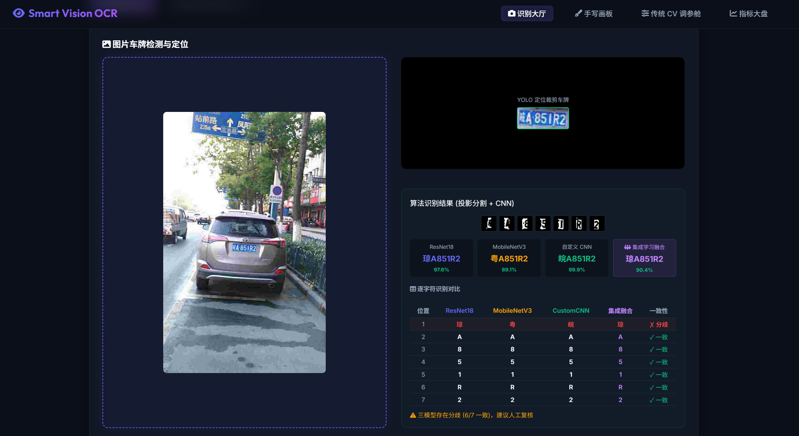
*图1 车牌识别图片模式界面，展示YOLO定位裁剪、字符切片与四模型识别结果对比*

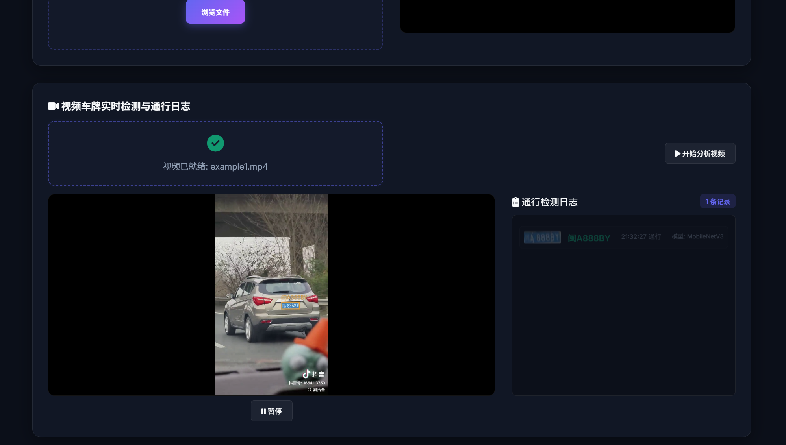
*图2 车牌识别视频模式界面，展示实时检测框、通行日志与模型来源*

#### 6.2.2 文档扫描与OCR模块

用户上传文档照片后，系统执行以下处理流水线：

1. **边缘检测**：Canny算子提取文档边界（低阈值75，高阈值200）；
2. **轮廓定位**：形态学膨胀连接边缘 → 轮廓检测 → 面积排序 → 多边形拟合（4顶点判定为文档）；
3. **透视变换**：将倾斜文档拉直为600×840标准矩形；
4. **增强处理**：CLAHE对比度均衡化 → 非局部均值去噪 → 锐化 → 自适应二值化；
5. **文字识别**：调用PaddleOCR引擎进行端到端文字检测与识别。

系统生成完整的分步可视化图片（边缘图、轮廓图、拉直图、增强图），帮助用户理解算法处理过程。

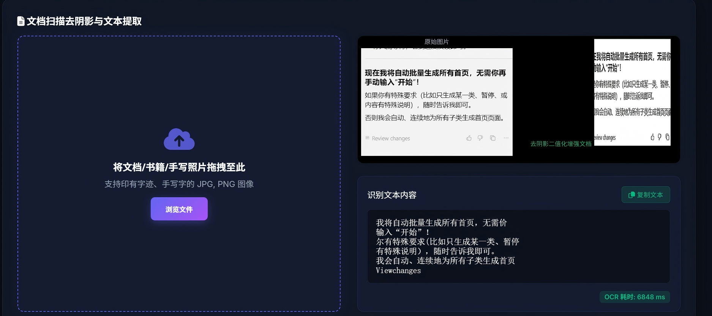
*图3 文档扫描识别结果界面，展示原始文档与PaddleOCR识别文本*

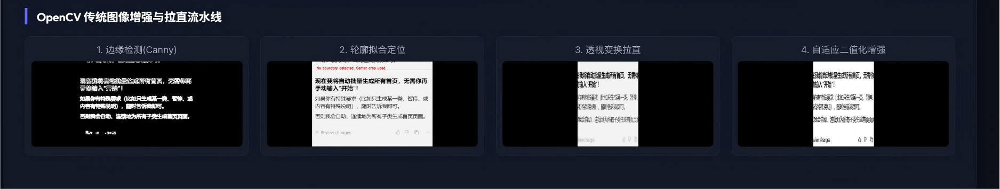
*图4 文档扫描分步处理流程，展示边缘检测、轮廓拟合、透视变换与二值化增强四个中间步骤*

#### 6.2.3 手写画板模块

基于HTML5 Canvas实现在线手写区域（280×280像素黑底白字），用户通过鼠标或触控板书写单个英文字母或阿拉伯数字。前端将画布内容编码为Base64 PNG图像，通过 `/api/predict_canvas` 接口发送至后端。后端同时调用三个模型进行推理，返回各模型的预测结果、置信度、推理耗时（毫秒级精度）与Top-5概率分布。前端以卡片形式并排展示三个模型的预测结果，并调用 `/api/gradcam` 接口生成GradCAM热力图，可视化各模型在字符图像上的注意力区域，帮助理解模型的决策依据。

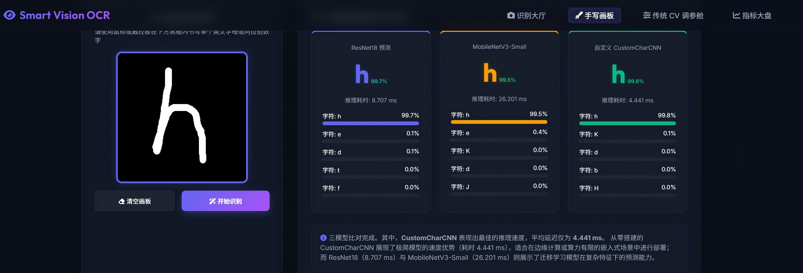
*图5 手写画板三模型推理实时对比界面，展示ResNet18、MobileNetV3-Small与CustomCharCNN的预测结果、置信度与Top-5概率分布*

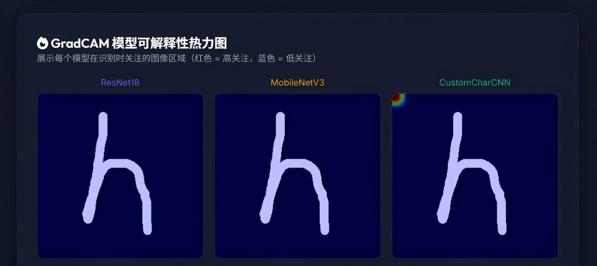
*图6 GradCAM模型可解释性热力图，展示三个模型在字符识别时关注的图像区域*

#### 6.2.4 传统CV调参舱模块

提供交互式参数调节界面，用户可通过滑块实时调整以下参数：
- Canny边缘检测阈值（低阈值、高阈值）；
- Sobel算子核大小；
- 全局二值化阈值、自适应二值化块大小与常数C；
- HSV颜色掩膜范围（H/S/V的最小值与最大值）。

系统实时计算并展示各参数组合下的处理效果对比图（边缘检测对比、二值化对比、HSV掩膜图），帮助用户直观理解传统CV算子的工作原理与参数影响。

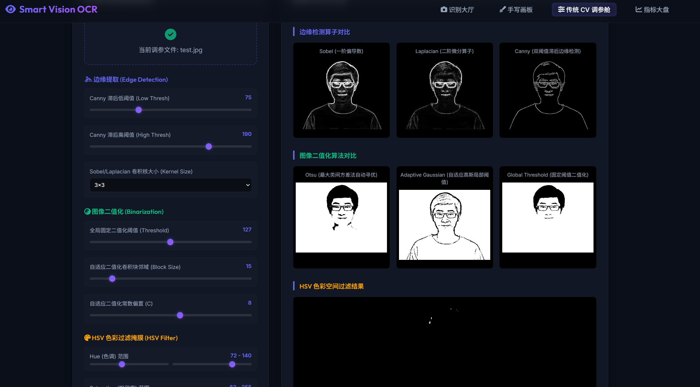
*图7 传统CV交互调参舱界面，展示Canny阈值、HSV掩膜等参数的实时调节与效果对比*

#### 6.2.5 指标大盘模块

以表格与图表形式展示所有模型在EMNIST和Plate两个数据集上的评估指标（Accuracy、Precision、Recall、F1-Score），并展示模型参数量、文件大小、推理速度等工程化指标的对比。支持训练曲线（Loss/Accuracy随Epoch变化）与混淆矩阵的可视化查看。

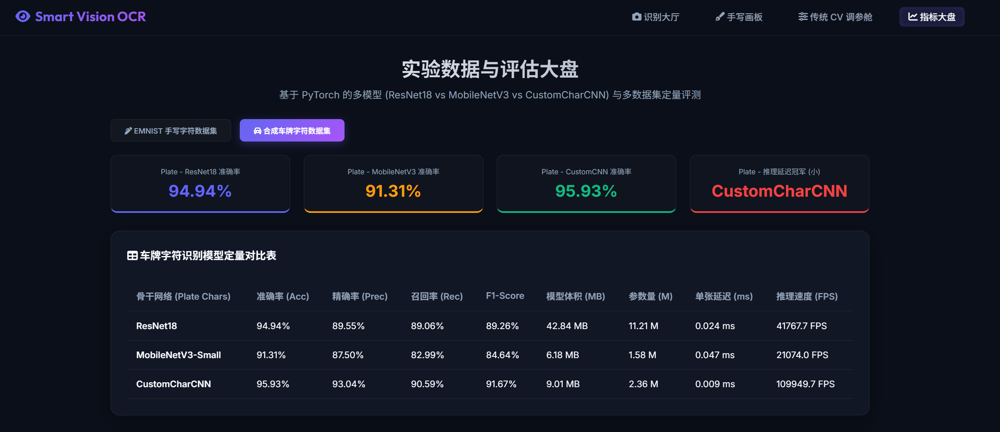
*图9 指标大盘界面，展示各模型在EMNIST与Plate数据集上的Accuracy、Precision、Recall、F1-Score对比及模型参数量、推理速度等工程化指标*

### 6.3 工程化优化

**（1）PIL中文渲染**：OpenCV的cv2.putText不支持中文字符渲染，系统采用PIL（Pillow）库的ImageDraw结合微软雅黑字体实现中文车牌号的叠加显示，确保省份汉字的正确展示。

**（2）MJPEG视频流**：通过Flask的Response生成器逐帧输出JPEG编码的视频帧，浏览器通过 `` 标签的MJPEG流实现实时播放，无需WebSocket等复杂通信机制。

**（3）多目标追踪**：采用基于IoU的轻量级追踪器，在相邻帧之间通过计算检测框的交并比（IoU）进行目标关联，维护目标的唯一ID与历史轨迹，避免重复识别。

**（4）自适应重识别**：当目标的识别置信度低于85%时，系统自动触发重新识别，使用更新的帧图像重新进行字符切割与分类，持续优化识别结果。

**（5）帧间平滑**：视频检测采用隔帧策略（每2帧检测一次），未检测帧复用上一帧的检测结果进行绘制，消除奇偶帧切换时的画面抖动。

<!-- ========== 7. 总结与展望 ========== -->

## 7. 总结与展望

### 7.1 项目总结

本项目成功构建了一套基于深度学习与传统计算机视觉融合的多功能智能文字识别系统，涵盖车牌检测识别、文档扫描OCR和手写字符识别三大核心功能，具备完整的数据处理→模型训练→推理部署→Web展示的端到端流程。主要成果如下：

**（1）模型性能方面：**
- 在车牌字符识别任务上，CustomCharCNN达到95.93%的最高分类准确率，ResNet18达到94.94%，三模型集成融合与位置约束掩码机制进一步提升了识别的鲁棒性与准确性；
- 在手写字符识别任务上，ResNet18达到88.47%的最佳验证准确率，通过增加训练轮次（30 epochs）和水平翻转数据增强，有效改善了形近字符（如6/9、L/7）的混淆问题；
- 实验验证了轻量级定制化网络（CustomCharCNN）在特定任务上可超越预训练迁移模型（ResNet18），为模型选型提供了实证参考。

**（2）系统工程方面：**
- 基于Flask框架实现了包含四个功能模块的Web应用前端，支持视频流实时检测、图片上传识别、手写画板交互与传统CV参数调优；
- 实现了多目标IoU追踪、置信度自适应重识别、PIL中文渲染、MJPEG视频流推送等工程化功能；
- 代码结构清晰，模块化设计良好，支持一键复现训练与推理结果。

### 7.2 不足与改进方向

本项目仍存在以下不足之处：

**（1）数据集规模与多样性有限：** CCPD-Base仅含约5000张原始车牌图片，字符数据虽达43.6万张但来源单一，且为程序合成生成，与真实场景存在分布差异。这可能导致模型在复杂光照、雨雾天气、部分遮挡等真实场景下的泛化能力不足。未来可引入CCPD全集（25万张）或更大规模的车牌数据集（如AAAI数据集、OCR数据集）进行训练。

**（2）端到端识别缺失：** 当前系统仍采用"检测→切割→分类"的分步式流水线，字符切割的准确性直接影响最终识别结果。当车牌倾斜角度过大、字符粘连或遮挡时，切割质量下降会导致识别错误。未来可引入CRNN+CTC（Connectionist Temporal Classification）或Attention-based序列识别模型，直接从车牌图像预测字符序列，避免显式切割步骤。

**（3）模型轻量化与部署优化：** 当前三个分类模型在推理阶段需独立运行，存在重复计算。未来可探索知识蒸馏（Knowledge Distillation）技术，将ResNet18的知识蒸馏到CustomCharCNN等轻量级学生模型中；或采用模型剪枝、量化等压缩技术，在保持精度的同时大幅降低推理延迟与模型体积。

**（4）场景覆盖不足：** 系统目前主要针对蓝牌小型汽车，对绿牌新能源车（8字符）、黄牌大型车、教练车等特殊车牌的支持有限。未来可扩展车牌颜色检测模块，针对不同车牌类型采用差异化的分割与识别策略。

**（5）鲁棒性提升：** 在极端光照（夜间、逆光）、严重遮挡（污损、反光）等场景下，系统的识别准确率仍有提升空间。未来可引入数据增强中的光照模拟、遮挡模拟，以及测试时增强（TTA）等技术提升模型的鲁棒性。

<!-- ========== 参考文献 ========== -->

## 参考文献

[1] Li H, Shen C. Reading car license plates: A survey and a deep learning-based approach[C]//IEEE Intelligent Vehicles Symposium, 2017: 1-6.

[2] Jocher G, Chaurasia A, Qiu J. Ultralytics YOLO (Version 8.0.0)[EB/OL]. https://github.com/ultralytics/ultralytics, 2023.

[3] He K, Zhang X, Ren S, et al. Deep residual learning for image recognition[C]//Proceedings of the IEEE Conference on Computer Vision and Pattern Recognition (CVPR), 2016: 770-778.

[4] Gonzalez R C, Woods R E. Digital Image Processing (4th Edition)[M]. Pearson, 2018.

[5] Dietterich T G. Ensemble methods in machine learning[C]//International Workshop on Multiple Classifier Systems, 2000: 1-15.

[6] Xu Z, Yang W, Meng A, et al. Towards end-to-end license plate detection and recognition: A large dataset and baseline[C]//Proceedings of the European Conference on Computer Vision (ECCV), 2018: 255-271.

[7] Cohen G, Afshar S, Tapson J, et al. EMNIST: An extension of MNIST to handwritten letters[C]//International Joint Conference on Neural Networks (IJCNN), 2017: 2921-2926.

[8] Howard A, Sandler M, Chu G, et al. Searching for MobileNetV3[C]//Proceedings of the IEEE/CVF International Conference on Computer Vision (ICCV), 2019: 1314-1324.
